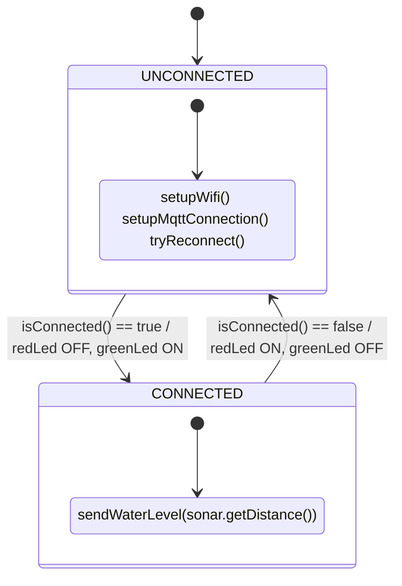
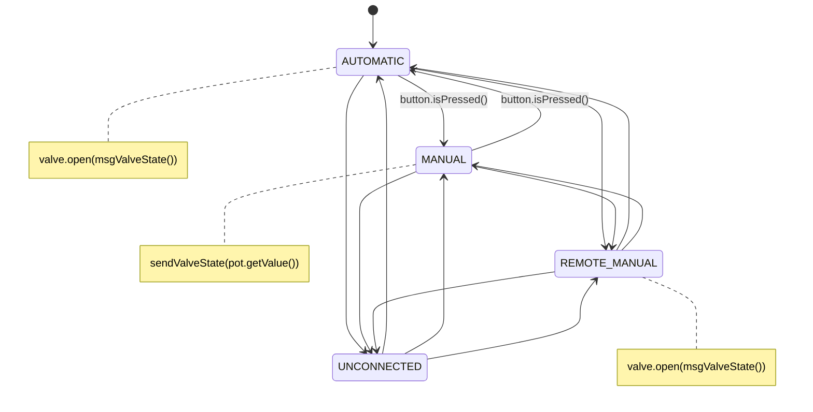
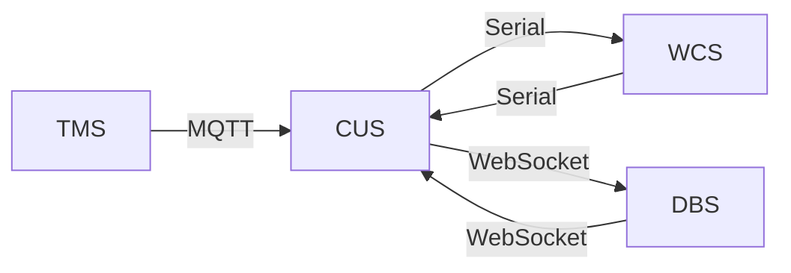

# Embedded Systems and IoT - a.y. 2025/2026  
## Assignment #03 – Smart Tank Monitoring System  

## Introduction

This project implements a **Smart Tank Monitoring System** using IoT principles. The system monitors and controls a rainwater tank, comprising four main subsystems: an embedded tank monitor, a control unit, a water channel actuator, and a remote dashboard. The core logic relies on finite state machines (FSMs) and defined communication protocols (MQTT, Serial, WebSocket).

---

## System Overview

The system automates rainwater management by:
- Measuring tank water level with an ESP32 (TMS)
- Governing logic and coordination via a server PC (CUS)
- Actuating a water release channel via Arduino (WCS)
- Presenting status, graphs, and controls through a web dashboard (DBS)

Modes:
- `AUTOMATIC` – system self-regulates based on water level
- `MANUAL` – operator sets valve manually with a potentiometer
- `REMOTE MANUAL` - operator sets valve via web interface
- `UNCONNECTED` – lost sensor connectivity
- `NOT AVAILABLE` – CUS unreachable

---

## Subsystem Architecture

### Tank Monitoring Subsystem (TMS)
- **Platform:** ESP32
- **Sensors/Actuators:** Ultrasonic sonar, green/red LEDs
- **Language:** C++
- **Responsibilities:**
  - Periodically sample tank level
  - Send readings to CUS via MQTT
  - Show network status (LEDs)
  - RTOS used for task scheduling and FSM

---

### Control Unit Subsystem (CUS)
- **Platform:** PC (server)
- **Language:** Python
- **Responsibilities:**
  - Central logic and decision making (“brain”)
  - Receive level data (MQTT) from TMS
  - Control WCS valve via serial
  - Serve/receive real-time data to/from DBS via WebSocket
  - State and safety timeouts/FSMs

---

### Water Channel Subsystem (WCS)
- **Platform:** Arduino UNO
- **Language:** C++
- **Actuators/Inputs:** Servo (valve), potentiometer, push button, LCD
- **Responsibilities:**
  - Valve control in response to CUS commands (serial)
  - Manual mode activation via button/pot
  - Display mode and valve % on LCD
  - FSM for input/debouncing and modes

---

### Dashboard Subsystem (DBS)
- **Platform:** Web app (PC/any device)
- **Language:** JavaScript, HTML, CSS
- **Responsibilities:**
  - Visualize tank level (graph N last points)
  - Show valve % and system state ("MANUAL", "AUTOMATIC", etc.)
  - Operator can switch modes and set valve % in REMOTE MANUAL mode
  - Real-time bidirectional communication with CUS via WebSocket for commands and telemetry

---

## Finite State Machines (FSMs)

### FSM for TMS

---

### FSM for WCS

- **LCD shows**: Current valve % and mode  
- **Potentiometer**: Only affects valve in MANUAL mode

---

### CUS Model Logic:
- If level > L2: Open valve 100%  
- If level > L1 for > T1, < L2: Open valve 50%  
- Revert to close when below L1  
- Set UNCONNECTED if no data from TMS for T2

---

## Subsystem Interaction Schema

- **TMS → CUS**: Tank level data via MQTT
- **CUS → WCS**: Valve commands via Serial
- **DBS ↔ CUS**: State/commands/valve via WebSocket

---

## Implementation Summary

- **Directory Structure:**
  - `/tms`: ESP32 (C++) code, RTOS tasks, FSM, MQTT client
  - `/cus`: Python server code; MQTT, serial, WebSocket handlers, core logic
  - `/wcs`: Arduino sketch; FSM, servo, button, pot, LCD drivers
  - `/DBS`: Web app (HTML/JS/CSS), UI controls/data chart
  - `/doc`: This report, system diagrams, and a demonstration video link

- **Breadboard/circuit**: See `/doc/breadboard.png` for hardware layout

---

## Demonstration Video

> [Demo Video Link – Drive](https://drive.google.com/file/d/12iokgU0lgSb8QYsz5qz4v-hXy7ZQAF3A/view?usp=sharing)

---
